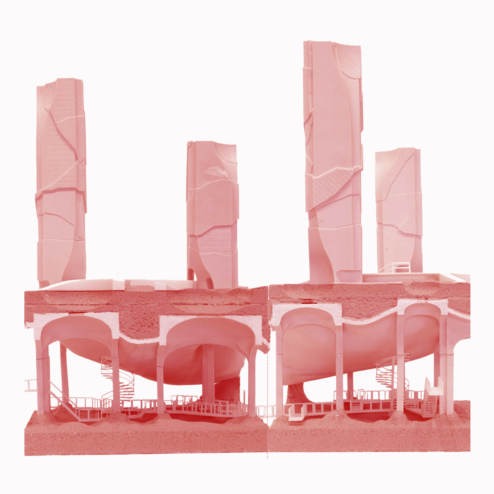

  

    
    

      <h1 class="icontext" style="font-family: 'Lato'; font-size:54px; color:gray">CODING</h1>
    

  

  

    
    

      <h1 class="icontext" style="font-family: 'Lato'; font-size:54px; color:gray">RESEARCH</h1>
    

  

  

    
    

      <h1 class="icontext" style="font-family: 'Lato'; font-size:54px; color:gray">DESIGN</h1>
    

  

  

    
    

      <h1 class="icontext" style="font-family: 'Lato'; font-size:54px; color:gray">TRAVEL</h1>
    

  

